# Snyk Workshop for IBM DDC Conference! 
## About this Workshop
Welcome! This workshop demonstrates how to use [Snyk Container](https://snyk.io/product/container-vulnerability-management/) and [Snyk Infrastructure as Code](https://snyk.io/product/infrastructure-as-code-security/) to identify security and configuration risks in a sample application deployed into OpenShift. In this developer-centric workshop, you'll need to be familiar with some common tools, described later.

The steps below guide you through:
1. Creating a delivery pipeline using OpenShift Pipelines 
2. Importing an OpenShift workload into Snyk for scanning and monitoring,
3. Reviewing the security and configuration scan results in the Snyk UI,
4. Finding and applying a more secure base image using Snyk’s upgrade guidance,
5. Securing the Goof application's deployment configuration within OpenShift.

> Note: For this workshop your facilitator invited you into the *IBM DDC WORKSHOP* organization in Snyk. To complete the workshop on your own, you need a Snyk account with the [Business plan](snyk.io/plans) and your own cluster to deploy the Kubernetes integration into. 

## Your demo environment
You were provided a cluster for this workshop. Complete the workshop in your assigned Cluster. Your Cluster includes:

- A running [Snyk Controller](https://support.snyk.io/hc/en-us/articles/360006548317-Install-the-Snyk-controller-with-OpenShift-4-and-OperatorHub) deployed by the Snyk Operator.

> Note: Not following along live? The Snyk Monitor needs Secrets for the Integration ID and registry credentials as shown in the [Snyk Operator Installation Docs](https://support.snyk.io/hc/en-us/articles/360006548317-Install-the-Snyk-controller-with-OpenShift-4-and-OperatorHub). For this workshop, RHPDS creates these for you. 

## How the Snyk Controller works
The Snyk Controller integrates with OpenShift to test running workloads and identify security vulnerabilities and configuration risks that might make the workload less secure. It communicates with the OpenShift API to determine which workloads are running, scans them, and reports results back to Snyk. The following workloads can be scanned:
- Deployment
- DeploymentConfig
- ReplicaSets
- DaemonSets
- StatefulSets
- Jobs
- CronJobs
- ReplicationControllers
- Pods

To import workloads into Snyk, users can select workloads in the Snyk UI, or import them automatically using annotations. These options are as described in [Adding Kubernetes workloads for security scanning](https://support.snyk.io/hc/articles/360003947117#UUID-a0526554-0943-3363-6977-7a11f766ede2).

# Part 1: Deploy an Application to OpenShift using Tekton Pipelines
TODO: Oliver Write this!
1. Create Quay secret (oc create secret)
2. Replace the GitHub Repo in pipeline.yml
3. Oliver's instructions

# Part 2: Import the Goof Deployment into Snyk

> You must have joined the *IBM DDS WORKSHOP* Snyk Organization to continue.

First, start by importing the Goof Deployment into Snyk so we can review the application's security and configuration scan results.

1. Sign in to Snyk, then switch to the IBM DDC WORKSHOP Organization under the Red Hat Group.

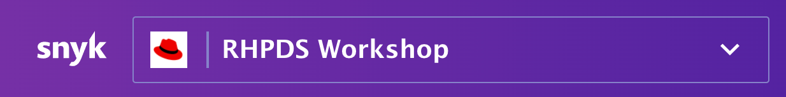

2. Navigate to the Projects tab. 

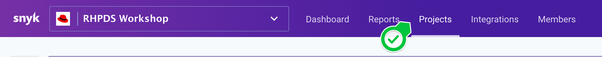

3. Click the Add Projects button, then select the Kubernetes tile.

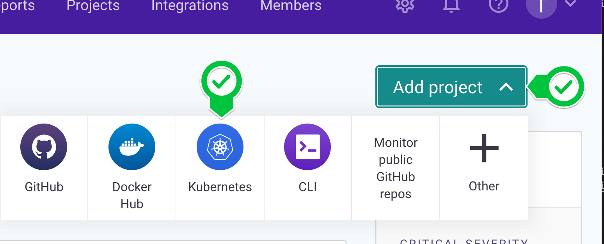

4. In the workload selection screen, find the OpenShift cluster named by your facilitator, select the user assigned to you, then select the Goof workload for import. 

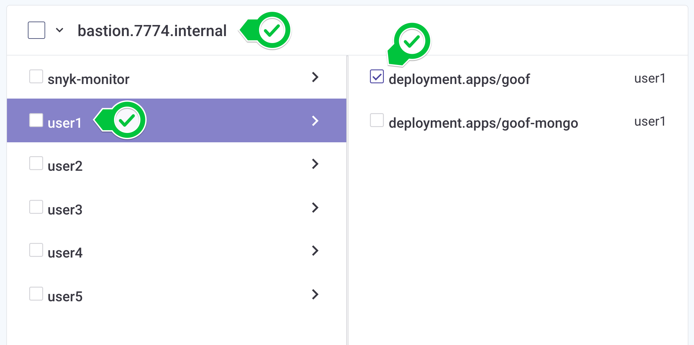

5. After the import completes, find the Snyk project imported from your assigned OpenShift project. Each imported Snyk project item is named according to its OpenShift metadata as follows: Project/kind/name.

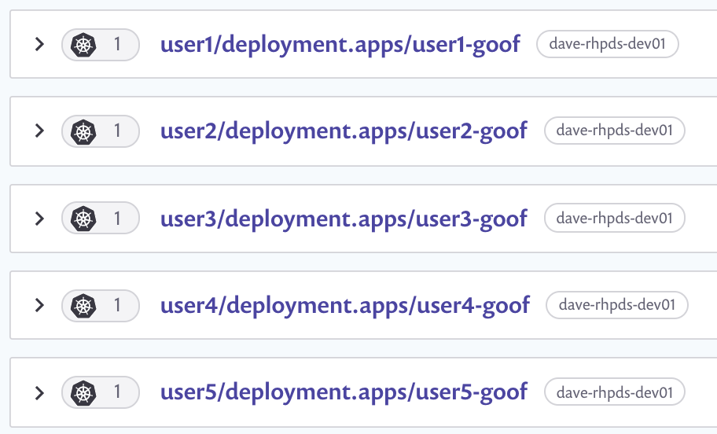

6. Expand the project list to see a list of the images used by the workload. For workloads with multiple images, the top row aggregates the count of vulnerabilities across all images.

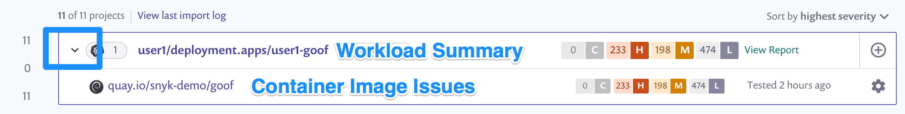

7. Click the workload link to see details around the security posture of the workload configuration. For information on what we test for, visit [viewing project details and test results](https://support.snyk.io/hc/en-us/articles/360003916178-Viewing-project-details-and-test-results).

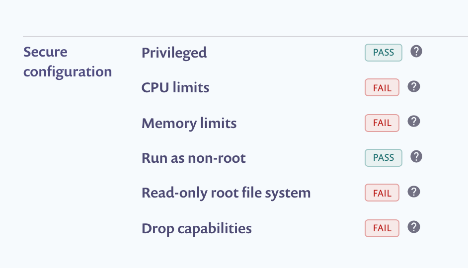

8. Return to the Projects Tab, now click the image name to view a list of its vulnerabilities. Scroll down to see the list of issues, ordered by Snyk's [Priority Score](https://support.snyk.io/hc/en-us/articles/360009884837). Each card represents a vulnerability in the image, and displays:
    - The issue type, and informative links to the [Snyk Intel DB](https://snyk.io/product/vulnerability-database/), CVE, and CWE
    - The direct and/or indirect dependency that introduced the vulnerability,
    - Details on the path and possible remediation,
    - If available, [relative importance](https://support.snyk.io/hc/en-us/articles/360013304357) from the Linux distribution's upstream tracker.

> Workload configuration information contributes to the vulnerabilies' Priority Score, based on the idea that a vulnerability in a workload that is poorly configured scores higher than the same vulnerability in a well configured one. For more information visit [Snyk Priority Score and Kubernetes](https://support.snyk.io/hc/en-us/articles/360010906897-Snyk-Priority-Score-and-Kubernetes). 

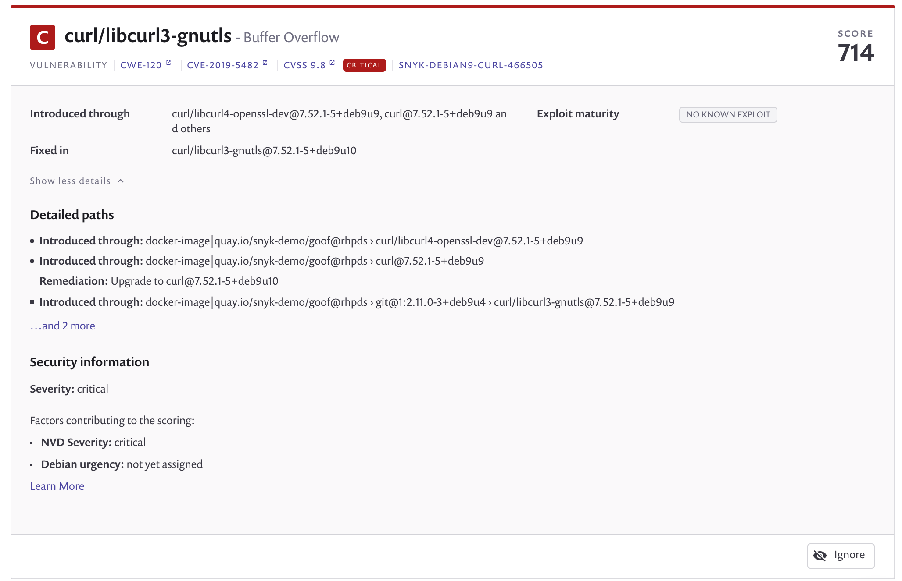

9. Switch to the Dependencies Tab to see the container's Dependency Tree.

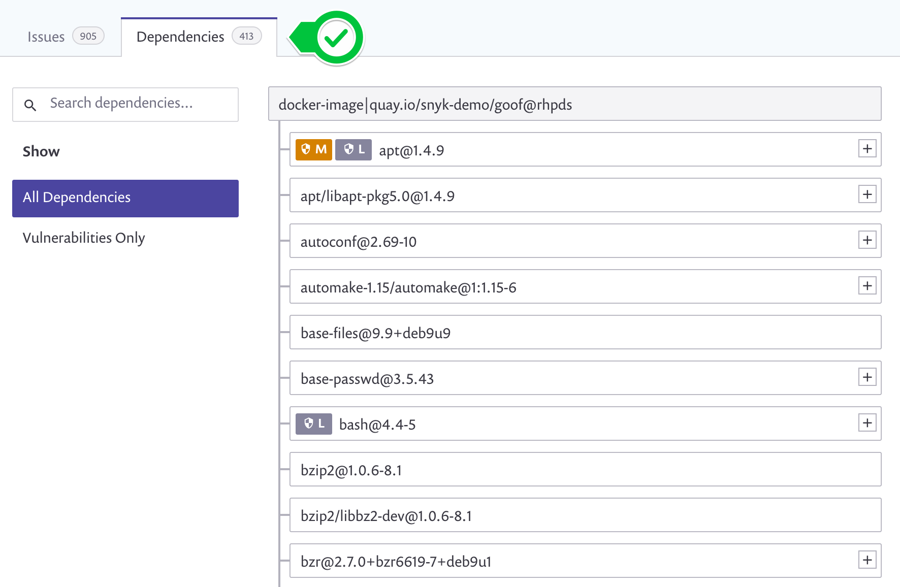

10. Return to the Issues Tab. To give us a head start remediating the vulnerabilities in Goof, Snyk presents base image upgrade guidance grouped by how likely they are to be compatible with our application. We'll learn how to interpret these recommendations in Part 2.

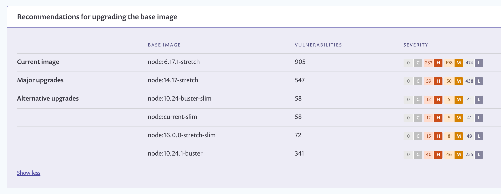

## You completed Part 2! 

In Part 3 we'll use this upgrade guidance, as well as explore the Snyk Infrastructure as Code configuration scan, to apply a more secure base image to Goof and address some of the configuration risks identified by the scan. 

# Part 3: Acting on Snyk Upgrade Guidance
A benefit of using Snyk Monitor to monitor running workloads is that once imported into the UI, Snyk continues to monitor the workload, re-testing for issues as new images are deployed and the workload configuration changes.

In this section, you use Snyk Container's Base Image Upgrade Guidance and Snyk Infrastructure as Code (IaC) to address the security and configuration issues identified in Part 1 of the workshop. Let's begin!

## Get Ready: Import the Goof-RHPDS Repo into Snyk

TODO: Tomas to write the steps to import te application into Snyk. 

1. Sign in to Snyk, then switch to the IBM DDC WORKSGOP Organization under the Red Hat Group.


2. Create GitHub Intgration
3. Import

## Part 3, Module 1: Addressing Container Vulnerabilities
### Clone the code

TODO: Write the Dockerfile project instructions

In Part 1 we saw vulnerabilities present in the Goof application. To remediate them, you'll re-build the image with a more secure base image. This code for Goof is available at `https://github.com/snyk-partners/goof-rhpds`. 


### Scan the Container Image for Vulnerabilities

Developers can use the Snyk CLI to get vulnerability information and base image upgrade guidance.

1. Scan the image by running the following command.

```
snyk container test quay.io/$QUAY_USER/goof:before --file=Dockerfile
```

2. When the scan completes, review the list of vulnerabilities. There are quite a few! If available, Snyk will recommend other potential base images to help you build your container with as few vulnerabilities as possible.

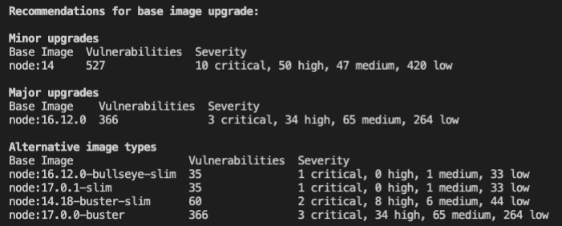

Snyk recommends less vulnerable base images grouped by how likely they are to be compatible:

- Minor upgrades are the most likely to be compatible with little work,
- Major upgrades can introduce breaking changes depending on image usage,
- Alternative architecture images are shown for more technical users to investigate.

> Open Source vulnerabilities are disclosed daily, so the recommendations you see may differ as the Snyk vulnerability database is constantly updated. This example shows upgrade recommendations as of the day of writing.

### Apply a more secure base image with a PR

TODO: TOmas qwill write

1. To apply a new base image, open the Dockerfile and replace, or comment out, the old base image with a new one. In this example, we’ll use node:14.16.1.

### Part 3, Module 2: Fix Configuration Issues

In Part 1 we also saw that Goof was poorly configured. With Snyk Infrastructure as Code, you can test configuration files directly from the CLI. 

TODO: TOMAS TO WRITE USING THE GITHUB INTEGRATION

1. Back in your Terminal, scan for IAC issues in the Deployment file with the Snyk CLI by running the following command.

2. Review the IAC scan results. For each file, Snyk displays a list of vulnerabilities—sorted by severity, where each is detailed as follows:

- A clear heading line - specifying the issue that has been detected, the severity of that issue and the Snyk Policy Id for that particular issue.
- Location - the property path within the configuration file at which the issue has been identified. 

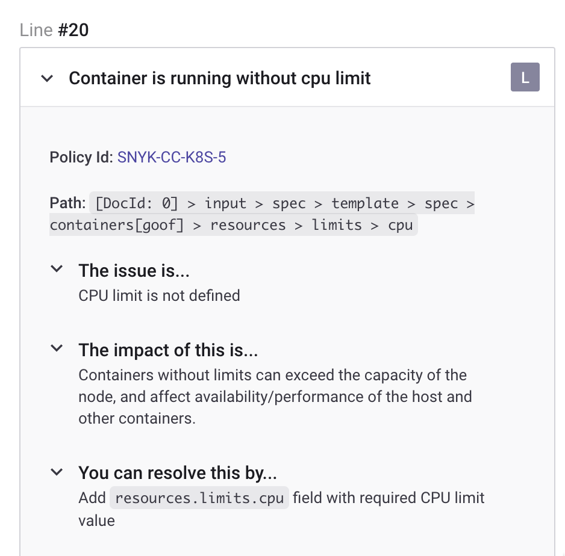

We'll use this information to guide changes to the deployment configuration in OpenShift.

3. Back in OpenShift, return to the Goof Deployment, then Edit Deployment settings as before. This time, switch to the YAML view. 

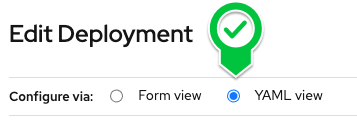

4. Modify the deployment to add limits for the CPU and Memory, as shown in the snippet of YAML below. Press Save when finished.

```YAML
resources:
  limits:
    cpu: 250m
    memory: 100Mi
  requests:
    cpu: 100m
    memory: 100Mi
```

6. Back in Snyk, find your Project and verify that your workload has better configuration!

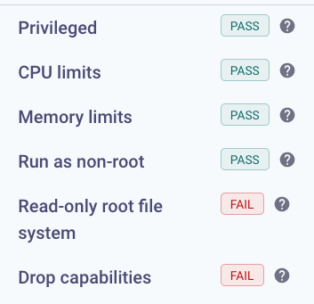

That's it! If you want, continue until all the configuration checks called out by Snyk are green.

# Conclusion

You reached the end of this workshop! This is one example of how Snyk guides developers through remediating vulnerabilities. There is much more we didn’t show, from our CI/CD integrations, API, and integrations into SCM and the Quay Registry. 

If you’re interested in other Snyk capabilities, let us know how much you liked this workshop and we'll work on adding it more in for future sessions! You can also subscribe to and get started with Snyk from the [Red Hat Marketplace](https://marketplace.redhat.com/en-us/products/snyk-container). 
