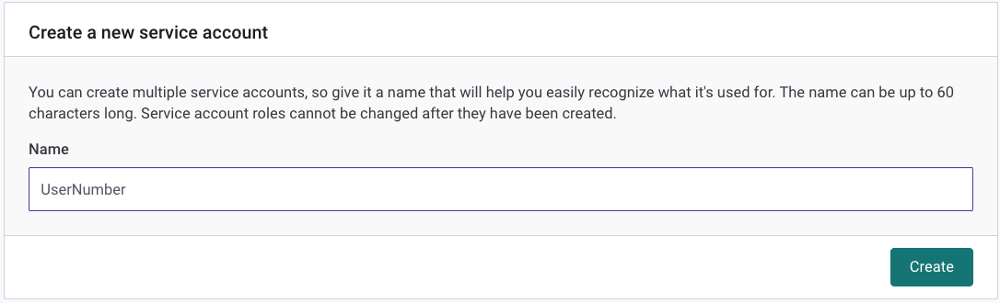

# Snyk on OpenShift for RHPDS 
## About this Workshop
Welcome! This workshop demonstrates how to use [Snyk Container](https://snyk.io/product/container-vulnerability-management/) and [Snyk Infrastructure as Code](https://snyk.io/product/infrastructure-as-code-security/) to identify security and configuration risks in a sample application deployed into OpenShift. 

The steps below guide you through:
1. Importing an OpenShift workload into Snyk for scanning and monitoring,
2. Reviewing the security and configuration scan results in the Snyk UI,
3. Finding and applying a more secure base image using Snyk’s upgrade guidance,
4. Securing the Goof application's deployment configuration within OpenShift.

> Note: This workshop is intended to be used with the Red Hat Partner Demo System (RHPDS). For a non-RHPDS version, check out the [Red Hat Patterns in the Snyk Academy](https://solutions.snyk.io/partner-workshops/red-hat).

> Note: To complete this workshop you'll need access to the Snyk NFR instance for Red Hat. Contact [Dave Meurer](mailto:dmeurer@redhat.com) or [Tomas Gonzalez](mailto:tomas@snyk.io) to request access.

## Your demo environment
The OpenShift demo environment includes a Project assigned to you. Complete the workshop in your assigned Project. Your Project includes:

- A deployment of Snyk's vulnerable [Goof](https://github.com/snyk/goof) application, and  
- A running [Snyk Controller](https://support.snyk.io/hc/en-us/articles/360006548317-Install-the-Snyk-controller-with-OpenShift-4-and-OperatorHub) deployed by the Snyk Operator.

Goof is externally exposed using a Route. Navigate to Networking > Routes > Goof to interact with it.

 Note: Deploying the Snyk Monitor into a non-RHPDS cluster requires Secrets for the Integration ID and registry credentials as shown in the [Snyk Operator Installation Docs](https://support.snyk.io/hc/en-us/articles/360006548317-Install-the-Snyk-controller-with-OpenShift-4-and-OperatorHub). For this workshop, RHPDS creates these for you. 

## How the Snyk Controller works
The Snyk Controller integrates with OpenShift to test running workloads and identify security vulnerabilities and configuration risks that might make the workload less secure. It communicates with the OpenShift API to determine which workloads are running, scans them, and reports results back to Snyk. The following workloads can be scanned:
- Deployment
- DeploymentConfig
- ReplicaSets
- DaemonSets
- StatefulSets
- Jobs
- CronJobs
- ReplicationControllers
- Pods

To import workloads into Snyk, users can select workloads in the Snyk UI, or import them automatically using annotations. These options are as described in [Adding Kubernetes workloads for security scanning](https://support.snyk.io/hc/articles/360003947117#UUID-a0526554-0943-3363-6977-7a11f766ede2).

# Let's get started!
## Part 1: Import the Goof Deployment into Snyk
Start by importing the Goof Deployment into Snyk, so we can review the security and configuration scan results.

1. Sign into Snyk. Ensure the Red Hat Partner organization is selected, then navigate to the Projects tab. 


2. Click the Add Projects button, then select the Kubernetes tile.


3. In the workload selection screen, select the user assigned to you, then select the Goof workload for import.


4. After the import completes, find the Snyk project imported from your assigned OpenShift project. Each imported Snyk project item is named according to its OpenShift metadata as follows: Project/kind/name.


5. Expand the project list to see a list of the images used by the workload. For workloads with multiple images, the top row aggregates the count of vulnerabilities across all images.


6. Click the workload link to see details around the security posture of the workload configuration. For information on what we test for, visit [viewing project details and test results](https://support.snyk.io/hc/en-us/articles/360003916178-Viewing-project-details-and-test-results).


7. Return to the Projects Tab, now click the image name to view a list of its vulnerabilities. Scroll down to see the list of issues, ordered by Snyk's [Priority Score](https://support.snyk.io/hc/en-us/articles/360009884837). Each card represents a vulnerability in the image, and displays:
    - The issue type, and informative links to the [Snyk Intel DB](https://snyk.io/product/vulnerability-database/), CVE, and CWE
    - The direct and/or indirect dependency that introduced the vulnerability,
    - Details on the path and possible remediation,
    - If available, [relative importance](https://support.snyk.io/hc/en-us/articles/360013304357) from the Linux distribution's upstream tracker.

> Workload configuration information contributes to the vulnerabilies' Priority Score, based on the idea that a vulnerability in a workload that is poorly configured scores higher than the same vulnerability in a well configured one. For more information visit [Snyk Priority Score and Kubernetes](https://support.snyk.io/hc/en-us/articles/360010906897-Snyk-Priority-Score-and-Kubernetes). 


8. Switch to the Dependencies Tab to see the container's Dependency Tree.


9. Return to the Issues Tab. To give us a head start remediating the vulnerabilities in Goof, Snyk presents base image upgrade guidance grouped by how likely they are to be compatible with our application. 
    - Minor upgrades are the most likely to be compatible with little work, 
    - Major upgrades can introduce breaking changes depending on image usage,
    - Alternative architecture images are shown for more technical users to investigate.


In Part 2 we'll use this upgrade guidance, as well as explore the Snyk Infrastructure as Code configuration scan, to apply a more secure base image to Goof and address some of the configuration risks identified by the scan. 

## Part 2: Acting on Snyk Upgrade Guidance
A benefit of using Snyk Monitor to monitor running workloads is that once imported into the UI, Snyk continues to monitor the workload, re-testing for issues as new images are deployed and the workload configuration changes.

In this section, you use Snyk Container's Base Image Upgrade Guidance and Snyk Infrastructure as Code (IaC) to address the security and configuration issues identified in Part 1 of the workshop. Let's begin!
'
### Pre-Requisites

#### Create a Snyk Token

You received an invitation to the *OpenShift Workshop* Snyk Organization. Accept it, then create a Snyk Account for yourself, or use your existing Snyk account. 

Once signed in, switch to the OpenShift Workshop Organization under the Red Hat Group.


Navigate to [Snyk Account Settings](https://app.snyk.io/org/openshift-workshop/manage/service-accounts) and create a Service Account Token. Name it after your assigned user and save it as an environment variable. You’ll need it later.



```sh
SNYK_TOKEN=<<your_snyk_token>>
```

#### Install the Snyk CLI

In this module we use the Snyk CLI to test our Container Image and IAC files. Visit the Snyk documentation to [Install the Snyk CLI](https://docs.snyk.io/features/snyk-cli/install-the-snyk-cli) and install it on your system. After installing, verify your installation by running: 

```sh
snyk --version
```

Authenticate the Snyk CLI using the Snyk Token.

```sh
snyk auth $SNYK_TOKEN
```

> This token will stop working after this workshop. You can continue using your Free Snyk account after the workshop by re-authenticating the Snyk CLI to your Personal Organization.

#### Create a Quay.io Account and Token

Log in to Quay.io with your Red Hat ID.

Save your Quay Username as an Environment Variable to use it in future steps. Your Quay Username is displayed in the upper right corner of Quay.io.

TODO: add image

```sh
QuayUser=<<your_quay_id>>
```

In this module you’ll push container images to Quay.io. Log in to Quay.io by running the following command:

```sh
docker login quay.io -u $QuayUser
```

Enter your password when prompted.

#### Install and authenticate OpenShift tools

TODO: Ask Dave if we include this...

We'll use the `oc` command line to interact with the OpenShift cluster. You can install the OpenShift CLI (oc) either by downloading the binary or by using an RPM.

Follow the [OpenShift Documentation](https://docs.openshift.com/container-platform/4.9/cli_reference/openshift_cli/getting-started-cli.html) to install the OC CLI.  

### Part 2, Module 1: Addressing Container Vulnerabilities
#### Clone the code

In this workshop, we use the deliberately vulnerable application named "goof."  This Node.js application is available from our public GitHub repository at `https://github.com/snyk-partners/goof-openshift`. Clone the repo, and change into the application directory. 
```
git clone https://github.com/snyk-partners/goof-openshift
cd goof-openshift
```

#### Build the Container Image

Now that you’ve cloned the repo to your working environment, build the image that runs Goof in OpenShift using the following command:

```
docker build -t quay.io/$QUAY_USER/goof:before .
```

#### Scan the Container Image

As we saw in Part 1 of this workshop, Snyk identified vulnerable components in this image. Developers can use the Snyk CLI to get vulnerability information and base image upgrade guidance.

Scan the image by running the following command.

```
snyk container test quay.io/$QUAY_USER/goof:before --file=Dockerfile
```

When the scan completes, review the list of vulnerabilities. There are quite a few! If available, Snyk will recommend other potential base images to help you build your container with as few vulnerabilities as possible.


TODO: Add this image ^

Snyk recommends less vulnerable base images grouped by how likely they are to be compatible:

Minor upgrades are the most likely to be compatible with little work,
Major upgrades can introduce breaking changes depending on image usage,
Alternative architecture images are shown for more technical users to investigate.

#### Apply a more secure base image

To apply a new base image, open the Dockerfile in and replace, or comment out, the old base image with a new one. In this example, we’ll use node:14.16.1.

TODO: Validate this base image. Update the repo Dockerfile from node6 to node14.

> Open Source vulnerabilities are disclosed daily, so the recommendations you see may differ as the Snyk vulnerability database is constantly updated. This example shows upgrade recommendations as of the day of writing. The actual version numbers may differ for you.

```Dockerfile
#FROM node:14.1.0
FROM node:14.16.1

RUN mkdir /usr/src/goof
COPY . /usr/src/goof
WORKDIR /usr/src/goof

RUN npm install
EXPOSE 3112
EXPOSE 31337
CMD ["npm", "start"]
```
When ready, save the changes.

Now build and push the image to Quay.io, using a new tag.

docker build -t quay.io/$QUAY_USER/goof:after .
docker push quay.io/$QUAY_USER/goof:after

In the next step we’ll re-deploy the application to OpenShift.

#### Modify the Goof Deployment's config

Dave: do we want to do this through OC or in the OpenShift Developer Experience?

- Update the YAML in OpenShift to reflect new registry
- Bounce the Application in OpenShift
- Revisit Snyk UI to verify new results

TODO: Write these steps.

### Part 2, Module 2: Fix Configuration Issues
With Snyk Infrastructure as Code, you can test your configuration files directly from the CLI. 

#### Scan for IAC issues with the CLI

Scan for IAC issues in the Deployment file with the Snyk CLI by running the following command.

```sh
snyk iac test manifests/
```

#### Review the IAC issues
For each file checked, Snyk displays a list of vulnerabilities—sorted by severity, where each is detailed as follows:

- A clear heading line - specifying the issue that has been detected, the severity of that issue and the Snyk Policy Id for that particular issue.
- Location - the property path within the configuration file at which the issue has been identified. 

For example,
The path of this issue is specified as...
In the following code you can see that line 1 represents the contents of the ... block named ... which is missing the ... field.


We'll use this information to guide changes to the deployment configuration in OpenShift.

#### Secure the configuration in OpenShift

TODO: Do we want to update locally then use OC to push the change, or use the Developer Experience? 

- Edit the Deployment YAML in the OpenShift UI

If you want, continue until all the configuration checks called out by Snyk are green.

# Conclusion

You reached the end of this workshop! This is one example of how Snyk guides developers through remediating vulnerabilities. There is much more we didn’t show, from our CI/CD integrations, API, and integrations into SCM and the Quay Registry. If you’re interested in other Snyk capabilities, let us know how much you liked this workshop and we'll work on adding it more in for future sessions! 

