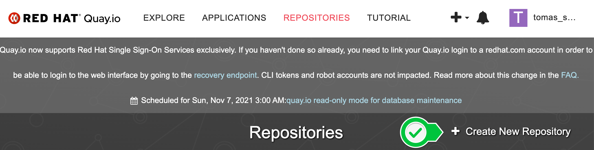
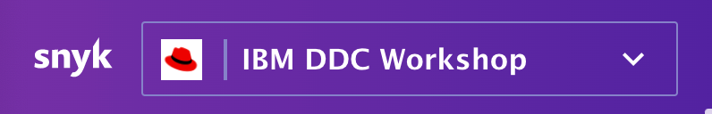

# Snyk Workshop for IBM DDC Conference! 
## About this Workshop
Welcome! This workshop demonstrates how to use [Snyk Container](https://snyk.io/product/container-vulnerability-management/) and [Snyk Infrastructure as Code](https://snyk.io/product/infrastructure-as-code-security/) to identify security and configuration risks in a sample application deployed into OpenShift. 

In this workshop you'll:
1. Creating an application delivery pipeline using OpenShift Pipelines 
2. Import the application's OpenShift deployment into Snyk for scanning and monitoring,
3. Review the security and configuration scan results in the Snyk UI,
4. Apply a more secure base image using Snyk’s upgrade guidance,
5. Fix an Open Source Vulnerability using a Fix Pull Request
5. Secure the Goof application's deployment configuration within OpenShift.

> Note: For this workshop your facilitator invited you into the *IBM DDC WORKSHOP* organization in Snyk. To complete the workshop on your own, you need a Snyk account with the [Business plan](snyk.io/plans) and your own cluster to deploy the Kubernetes integration into. 

## Your demo environment
You were provided a cluster for this workshop. Complete the workshop in your assigned Cluster. Your Cluster includes:

- A running [Snyk Controller](https://support.snyk.io/hc/en-us/articles/360006548317-Install-the-Snyk-controller-with-OpenShift-4-and-OperatorHub) deployed by the Snyk Operator.

> Note: Not following along live? The Snyk Monitor needs Secrets for the Integration ID and registry credentials as shown in the [Snyk Operator Installation Docs](https://support.snyk.io/hc/en-us/articles/360006548317-Install-the-Snyk-controller-with-OpenShift-4-and-OperatorHub). For this workshop, RHPDS creates these for you. 

## How the Snyk Controller works
The Snyk Controller integrates with OpenShift to test running workloads and identify security vulnerabilities and configuration risks that might make the workload less secure. It communicates with the OpenShift API to determine which workloads are running, scans them, and reports results back to Snyk. The following workloads can be scanned:
- Deployment
- DeploymentConfig
- ReplicaSets
- DaemonSets
- StatefulSets
- Jobs
- CronJobs
- ReplicationControllers
- Pods

To import workloads into Snyk, users can select workloads in the Snyk UI, or import them automatically using annotations. These options are as described in [Adding Kubernetes workloads for security scanning](https://support.snyk.io/hc/articles/360003947117#UUID-a0526554-0943-3363-6977-7a11f766ede2).

# Get access to the OpenShift Cluster

1. [Contact us in Slack](https://digitaldevcon.slack.com/archives/C01SRHYT7QB) to request access to the OpenShift cluster for this workshop. 

2. Once signed in, click your username in the upper right corner and Copy Login Command.


3. Authenticate the OC client on your workstation.

# Part 1: Set up a CI/CD Pipeline using Tekton Pipelines

1. Ensure that you have completed all of the [prerequisites](https://github.com/snyk-partners/snyk-rhpds/blob/add-tekton/prerequisites.md) before continuing. 

1. The repo that you cloned in the prerequisties has a deployment file that we must edit before we deploy later on. This file currently points to the main Goof repo but instead we need to point to your copy of the repo.

    - In a code editor open up `./manifests/goof.yaml` and look at line 19.

        ```yaml
        image: snyklabs/goof:latest #Edit with your Quay ID
        ```

    - Remove `snyklabs` and add `quay.io/<your quay username>` replacing `<your quay username>` with your actual quay username. For example, my username is odrodrig_us so my line 19 will look like this:

        ```yaml
        image: quay.io/odrodrig_us/goof:latest #Edit with your Quay ID
        ```

    - Save the file when you are done.

1. Install the Tekton tasks

    1. Install git-clone task

        ```bash
        oc apply -f https://raw.githubusercontent.com/tektoncd/catalog/v1beta1/git/git-clone.yaml
        ```

    1. Install snyk-node task

        ```bash
        oc apply -f https://raw.githubusercontent.com/garethr/snyk-tekton/master/node/node.yaml
        ```

    1. Install Kaniko task (For building container images)

        ```bash
        kubectl apply -f https://raw.githubusercontent.com/tektoncd/catalog/main/task/kaniko/0.5/kaniko.yaml
        ```

    1. Install the deploy-using-kubectl task

        ```bash
        kubectl apply -f pipeline/deploy-using-kubectl.yaml
        ```

1. In order to use Snyk from our pipeline we will need a service account that will authenticate with Snyk. For this workshop, a service account has already been created for you and the token that will be used for authentication is already in the command below:

1. Run the following command, to create the secret with the Snyk service account token

    ```bash
    oc create secret generic snyk --from-literal=token=e83425dd-b269-42fb-9926-7a333793dc56
    ```

    This token will only be available for the duration of the workshop.


## Setting up access to Quay
1. For this application we will be using the Quay container registry to store our container images. First we need to create a new repository in order to push images with our robot account.

    Navigate to [http://www.quay.io](http://www.quay.io)

1. Click on the `Create New Repository` button near the top right of the page.

    

1. Click on your username at the top right corner of the page and select `Account Settings`

    

1. Then, click on the tab on the left side of the page that looks like a robot.

    

1. Next, click on the blue `Create Robot Account` button on the right side of the page.

1. In the new dialog that appears give the robot a name like, `snyk_pipeline`. When done, click `Create Robot Account` at the bottom of the dialog window.

1. Then, on the next page, click on the checkbox next to the `goof` repository and in the `Permission` dropdown select `Admin`. When done, click on `Add Permissions`.

    

1. Next we need the credentials of the new robot account. Click on the settings icon to the right of the robot accounts table and select `View Credentials`.

    

1. You should now see the username and password for the robot account. Keep this page up and navigate back to your terminal.

1. Enter the following command and paste the username from the Quay robot account

    ```bash
    export REGISTRY_USERNAME=
    ```

    Press enter when done.

1. Then, enter the following command and paste in the password from the Quay robot account.

    ```bash
    export REGISTRY_PASSWORD=
    ```

    Press enter when done.

1. Next, we need to create the secret in OpenShift with these credentials so that we can authenticate with the registry from our pipeline. Run the following command to create the secret:

    ```bash
    oc create secret docker-registry quay-secret --docker-server=https://quay.io --docker-username=$REGISTRY_USERNAME --docker-password=$REGISTRY_PASSWORD
    ```

1. Now that the secret has been created, we need to give the Pipeline service account on OpenShift access to it so that it can be used in the build pipeline.

    ```bash
    oc secrets link pipeline quay-secret
    ```

1. Then, we need to add an annotation to our secret so that it can be used in Tekton.

    ```bash
    oc annotate secret quay-secret tekton.dev/docker-0=quay.io
    ```

## Create OpenShift Pipeline Components

1. Apply the pipeline

    ```bash
    oc apply -f pipeline/pipeline.yaml
    ```

1. Create a PVC for pipeline to use

    ```bash
    oc apply -f pipeline/snyk-pvc.yaml
    ```

1. Before we create the automation for Tekton, we need to make a change to our TriggerTemplate file. In a code editor, open `./pipeline/triggers/triggerTemplate.yaml` and go to line 28.

- Line 28 should look like the following:

    ```yaml
    value: quay.io/<quay_user>/goof
    ```

- Replace `<quay_user>` with your Quay username. For example, my Quay username is `odrodrig_us` so my line 28 will look like this:

    ```yaml
    value: quay.io/odrodrig_us/goof
    ```

    Save the file when done.

4. Create the Tekton Triggers components

    ```bash
    oc apply -f pipeline/triggers/
    ```

1. Next, in order to get webhook events from GitHub we need to create a secret. This secret isn't like an authentication token but rather a string that will be used to match the incoming events to ensure that we are listening to the correct webhook.

    ```bash
    oc create secret generic github-token --from-literal=token=1234567
    ```

1. One of the resources we created is the EventListener which acts as a sink to accept webhook events such as pull_request events from GitHub. By default, this service is only available internal to the cluster so we need to expose it to outside traffic via an OpenShift Route.

    ```bash
    oc expose service el-github-pr
    ```

1. Now we need to get the route that we just created so that we can create a webhook on GitHub.

    ```bash
    oc get route el-github-pr --template='http://{{.spec.host}}'
    ```

    Copy the URL that is returned.

## Creating the GitHub webhook

1. Navigate to your version of the goof repository and click on the `Settings` button.

    

1. Click on `Webhooks` in the left side of the page and click on the `Add Webhook` button that appears on the right side of the Webhooks page.

1. Now we need to configure the webhook:

    - For `Payload URL` enter the EventListener route that you copied previously.

    - For `Content-Type` select `Application/JSON`

    - For `Secret` enter `1234567`

    - Then select the `Let me select individual events` radio button

        - A list of events should appear. Scroll down and select `Pull_requests`

        

    - Next, scroll down and click on `Add webhook`.

With that configured, our pipeline will be triggered to build on any pull request opened. This will allow us to test out potential changes in a Pull Request before merging with our main branch.

(Optional) However, if you would like to run the pipeline manually, you can do the following:

- Open `./pipeline/pipeline-run.yaml` in a code editor

- Change the `GitUrl` and `ImageUrl` to point to your own resources.

- Run the Pipeline

    ```bash
    oc create -f pipeline/pipeline-run.yaml
    ```

## Viewing the Pipeline

1. Navigate to your openshift cluster console and find the Pipelines section on the left navigation menu, and select Pipelines.
1. From the Pipelines page select the tab that says Pipeline Runs.

    

1. You will then be able to see the status of the build process using the pipeline.
    - There are 5 steps:
        - Clone the code and store it in the PVC that was created
        - Import the project to snyk
        - Scan the code with Snyk
        - Build and push the container image
        - Deploy the application

1. If you view the output of the `snyk-test` step you can see the output of the Snyk scan.

    

# Part 2: Scan the Goof Deployment with Snyk

> You must have joined the *IBM DDS WORKSHOP* Snyk Organization to continue.

First, start by importing the Goof Deployment into Snyk so we can review the application's security and configuration scan results.

1. Sign in to Snyk, then switch to the IBM DDC WORKSHOP Organization under the Red Hat Group.



2. Navigate to the Projects tab. 


3. Click the Add Projects button, then select the Kubernetes tile.


4. In the workload selection screen, find the OpenShift cluster named by your facilitator, select the user assigned to you, then select the Goof workload for import. 


5. After the import completes, find the Snyk project imported from your assigned OpenShift project. Each imported Snyk project item is named according to its OpenShift metadata as follows: Project/kind/name.


6. Expand the project list to see a list of the images used by the workload. For workloads with multiple images, the top row aggregates the count of vulnerabilities across all images.


7. Click the workload link to see details around the security posture of the workload configuration. For information on what we test for, visit [viewing project details and test results](https://support.snyk.io/hc/en-us/articles/360003916178-Viewing-project-details-and-test-results).


8. Return to the Projects Tab, now click the image name to view a list of its vulnerabilities. Scroll down to see the list of issues, ordered by Snyk's [Priority Score](https://support.snyk.io/hc/en-us/articles/360009884837). Each card represents a vulnerability in the image, and displays:
    - The issue type, and informative links to the [Snyk Intel DB](https://snyk.io/product/vulnerability-database/), CVE, and CWE
    - The direct and/or indirect dependency that introduced the vulnerability,
    - Details on the path and possible remediation,
    - If available, [relative importance](https://support.snyk.io/hc/en-us/articles/360013304357) from the Linux distribution's upstream tracker.

> Workload configuration information contributes to the vulnerabilies' Priority Score, based on the idea that a vulnerability in a workload that is poorly configured scores higher than the same vulnerability in a well configured one. For more information visit [Snyk Priority Score and Kubernetes](https://support.snyk.io/hc/en-us/articles/360010906897-Snyk-Priority-Score-and-Kubernetes). 


9. Switch to the Dependencies Tab to see the container's Dependency Tree.


10. Return to the Issues Tab. To give us a head start remediating the vulnerabilities in Goof, Snyk presents base image upgrade guidance grouped by how likely they are to be compatible with our application. We'll learn how to interpret these recommendations in Part 2.


## You completed Part 2! 

In Part 3 we'll use this upgrade guidance, as well as explore the Snyk Infrastructure as Code configuration scan, to apply a more secure base image to Goof and address some of the configuration risks identified by the scan. 

# Part 3: Acting on Snyk Upgrade Guidance
A benefit of using Snyk Monitor to monitor running workloads is that once imported into the UI, Snyk continues to monitor the workload, re-testing for issues as new images are deployed and the workload configuration changes.

In this section, you use Snyk Container's Base Image Upgrade Guidance and Snyk Infrastructure as Code (IaC) to address the security and configuration issues identified in Part 1 of the workshop. Let's begin!

## Get Ready: Import the Goof-RHPDS Repo into Snyk

1. Sign in to Snyk, then switch to the IBM DDC WORKSHOP Organization under the Red Hat Group.


2. If you haven't already, configure Snyk's GitHub Integration by navigating to Integrations -> Source Control -> GitHub.


3. Once configured, import the repo into Snyk by clicking Add Project -> GitHub -> your fork of the goof-rhpds repo.


Now that it's imported, let's start fixing issues!

## Part 3, Module 1: Addressing Container Vulnerabilities

When the Repo imports, Snyk shows the supported manifest files in the repo, including our container's Dockerfile.


1. Click the Dockerfile to enter the project, and review the base image suggestions. Snyk recommends less vulnerable base images grouped by how likely they are to be compatible:

- Minor upgrades are the most likely to be compatible with little work,
- Major upgrades can introduce breaking changes depending on image usage,
- Alternative architecture images are shown for more technical users to investigate.

> Open Source vulnerabilities are disclosed daily, so the recommendations you see may differ! This example shows upgrade recommendations as of the day of writing.

2. To apply a new base image, open a Fix Pull Request to the next available Minor Upgrade.


3. This PR will kick off the pipeline. In OpenShift, navigate to to Pipelines to see the pipeline executing. The pipeline will fail, because there are still Open Source vulnerabilities to fix.

## Part 3, Module 2: Unblock the Pipeline

The pipeline will not allow us to deploy this image until we fix all dependencies with Critical Severity vulnerabilities with a Fix available. These are shown under the package.json project. 


1. Click into the `package.json` project and scroll down to see the list of vulnerabilities.

2. Use the filters on the left to view only the critical severity vulnerabilities with a fix available.


3. Click "Fix this Vulnerability" in the issue card to create a Fix PR that upgrades this component to remediate this vulnerability.


4. When it's ready, you'll be taken to the PR in GitHub, where you can review the changes in the file diff view.


5. Now merge the PR and return to Snyk. When it re-scans the repo, you should now have 0 critical severity vulnerabilities. 

6. Return to the Pipeline view. Your pipeline should now execute without fail.

### Part 3, Module 3: Fix Configuration Issues

In Part 1 we also saw that Goof was poorly configured. With Snyk Infrastructure as Code, you can test configuration files directly from GitHub.

1. In the Snyk project imported earlier, there are two Kubernetes manifests for the goof application. One deploys the application, and the other deploys the mongo database it needs.

2. Click into `goof.yaml` and review the IAC scan results. For each file, Snyk displays a list of vulnerabilities, where each is detailed as follows:

- A clear heading line - specifying the issue that has been detected, the severity of that issue and the Snyk Policy Id for that particular issue.
- Location - the path within the configuration file where the issue was  identified. 
- The impact of this vulnerability, and how to remediate it. 


We'll use this information to guide changes to the deployment configuration in OpenShift.

3. Back in OpenShift, return to the Goof Deployment, then Edit Deployment settings. This time, switch to the YAML view. 


4. Modify the deployment to add limits for the CPU and Memory, as shown in the snippet of YAML below. Press Save when finished.

```YAML
resources:
  limits:
    cpu: 250m
    memory: 100Mi
  requests:
    cpu: 100m
    memory: 100Mi
```

6. Back in Snyk, find your Project and verify that your workload has better configuration!


That's it! If you want, continue until all the configuration checks called out by Snyk are green.

# Conclusion

You reached the end of this workshop! This is one example of how Snyk guides developers through remediating vulnerabilities. There is much more we didn’t show, from our CI/CD integrations, API, and integrations into SCM and the Quay Registry. 

If you’re interested in other Snyk capabilities, let us know how much you liked this workshop and we'll work on adding it more in for future sessions! You can also subscribe to and get started with Snyk from the [Red Hat Marketplace](https://marketplace.redhat.com/en-us/products/snyk-container). 
