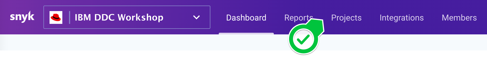

# Snyk on OpenShift for RHPDS 
## About this Workshop
Welcome! This workshop demonstrates how to use [Snyk Container](https://snyk.io/product/container-vulnerability-management/) and [Snyk Infrastructure as Code](https://snyk.io/product/infrastructure-as-code-security/) to identify security and configuration risks in a sample application deployed into OpenShift. 

The steps below guide you through:
1. Importing an OpenShift workload into Snyk for scanning and monitoring,
2. Reviewing the security and configuration scan results in the Snyk UI,
3. Finding and applying a more secure base image using Snyk’s upgrade guidance,
4. Securing the Goof application's deployment configuration within OpenShift.

> Note: This workshop is intended to be used with the Red Hat Partner Demo System (RHPDS). For a non-RHPDS version, check out the [Red Hat Patterns in the Snyk Academy](https://solutions.snyk.io/partner-workshops/red-hat).

> Note: To complete this workshop you'll need access to the Snyk NFR instance for Red Hat. Contact [Dave Meurer](mailto:dmeurer@redhat.com) or [Tomas Gonzalez](mailto:tomas@snyk.io) to request access.

## Your demo environment
The OpenShift demo environment includes a Project assigned to you. Complete the workshop in your assigned Project. Your Project includes:

- A deployment of Snyk's vulnerable [Goof](https://github.com/snyk/goof) application, and  
- A running [Snyk Controller](https://support.snyk.io/hc/en-us/articles/360006548317-Install-the-Snyk-controller-with-OpenShift-4-and-OperatorHub) deployed by the Snyk Operator.

Goof is externally exposed using a Route. Navigate to Networking > Routes > Goof to interact with it.

 Note: Deploying the Snyk Monitor into a non-RHPDS cluster requires Secrets for the Integration ID and registry credentials as shown in the [Snyk Operator Installation Docs](https://support.snyk.io/hc/en-us/articles/360006548317-Install-the-Snyk-controller-with-OpenShift-4-and-OperatorHub). For this workshop, RHPDS creates these for you. 

## How the Snyk Controller works
The Snyk Controller integrates with OpenShift to test running workloads and identify security vulnerabilities and configuration risks that might make the workload less secure. It communicates with the OpenShift API to determine which workloads are running, scans them, and reports results back to Snyk. The following workloads can be scanned:
- Deployment
- DeploymentConfig
- ReplicaSets
- DaemonSets
- StatefulSets
- Jobs
- CronJobs
- ReplicationControllers
- Pods

To import workloads into Snyk, users can select workloads in the Snyk UI, or import them automatically using annotations. These options are as described in [Adding Kubernetes workloads for security scanning](https://support.snyk.io/hc/articles/360003947117#UUID-a0526554-0943-3363-6977-7a11f766ede2).

# Let's get started!
## Part 1: Import the Goof Deployment into Snyk
Start by importing the Goof Deployment into Snyk, so we can review the security and configuration scan results.

1. Sign into Snyk. Ensure the Red Hat Partner organization is selected, then navigate to the Projects tab. 

2. Click the Add Projects button, then select the Kubernetes tile.

3. In the workload selection screen, select the user assigned to you, then select the Goof workload for import.

4. After the import completes, find the Snyk project imported from your assigned OpenShift project. Each imported Snyk project item is named according to its OpenShift metadata as follows: Project/kind/name.

5. Expand the project list to see a list of the images used by the workload. For workloads with multiple images, the top row aggregates the count of vulnerabilities across all images.

6. Click the workload link to see details around the security posture of the workload configuration. For information on what we test for, visit [viewing project details and test results](https://support.snyk.io/hc/en-us/articles/360003916178-Viewing-project-details-and-test-results).

7. Return to the Projects Tab, now click the image name to view a list of its vulnerabilities. Scroll down to see the list of issues, ordered by Snyk's [Priority Score](https://support.snyk.io/hc/en-us/articles/360009884837). Each card represents a vulnerability in the image, and displays:
    - The issue type, and informative links to the [Snyk Intel DB](https://snyk.io/product/vulnerability-database/), CVE, and CWE
    - The direct and/or indirect dependency that introduced the vulnerability,
    - Details on the path and possible remediation,
    - If available, [relative importance](https://support.snyk.io/hc/en-us/articles/360013304357) from the Linux distribution's upstream tracker.

> Workload configuration information contributes to the vulnerabilies' Priority Score, based on the idea that a vulnerability in a workload that is poorly configured scores higher than the same vulnerability in a well configured one. For more information visit [Snyk Priority Score and Kubernetes](https://support.snyk.io/hc/en-us/articles/360010906897-Snyk-Priority-Score-and-Kubernetes). 

8. Switch to the Dependencies Tab to see the container's Dependency Tree.

9. Return to the Issues Tab. To give us a head start remediating the vulnerabilities in Goof, Snyk presents base image upgrade guidance grouped by how likely they are to be compatible with our application. 
    - Minor upgrades are the most likely to be compatible with little work, 
    - Major upgrades can introduce breaking changes depending on image usage,
    - Alternative architecture images are shown for more technical users to investigate.

# Conclusion
You reached the end of this workshop! This is one example of how Snyk guides developers through identifying vulnerabilities. There is much more we didn’t show, from our CI/CD integrations, CLI, API, and integrations into the Quay Registry. If you’re interested in other Snyk capabilities, check out the other Red Hat Workshops in the Snyk Academy!
