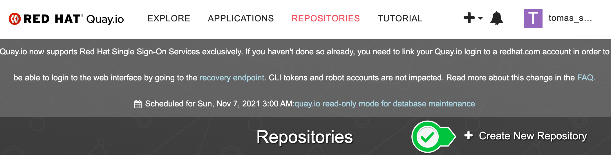
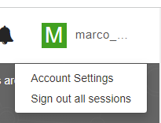

# Pre-requisites!
## Please complete these prior to the workshop! 

In this workshop, you will use of the following tools. Create free accounts for:
- Snyk
- Quay.io

You'll also need access to a few developer tools.
- Any IDE of your choosing (we recommend VS Code)
- Docker

You'll receive an e-mail the day before the workshop adding you to the OpenShift Workshop organization in Snyk. Keep an eye out! 

### Create a Snyk Account and Install the Snyk CLI

1. [Create a Snyk Account](https://app.snyk.io/login?utm_campaign=RHPDS&utm_medium=Partner&utm_source=Red-Hat) for yourself, or use your existing Snyk account. 

2. Visit the Snyk documentation to [Install the Snyk CLI](https://docs.snyk.io/features/snyk-cli/install-the-snyk-cli) and install it on your system. 

3. After installing, verify your installation by running: 

```sh
snyk --version
```

### Install Docker on your workstation

You'll need docker tools to build and push container images. 

1. Visit [Get Docker](https://docs.docker.com/get-docker/) and install Docker on your system. 

> This workshop guide uses Docker to build and push container images. If you prefer buildah and skopeo install those instead but we recommend proficiency with those tools as workshop staff might not be able to support you. 

2. Verify Docker installed correctly.

```sh
docker --version
```

### Create a Quay.io Account and Authenticate with your Docker client

1. Create an account or sign in to [Quay.io](https://quay.io).

2. Once signed in, create a Repository on Quay.io. We recommend calling it `goof`.



3. Save your Quay Username as an Environment Variable to use it in future steps. 

> Your Quay Username is displayed in the upper right corner of Quay.io. 



```sh
QUAY_USER=<<your_quay_id>>
```

3. In this module you’ll push container images to Quay.io. Log in to Quay.io by running the following command:

```sh
docker login quay.io -u $QUAY_USER
```

Enter your password when prompted.
